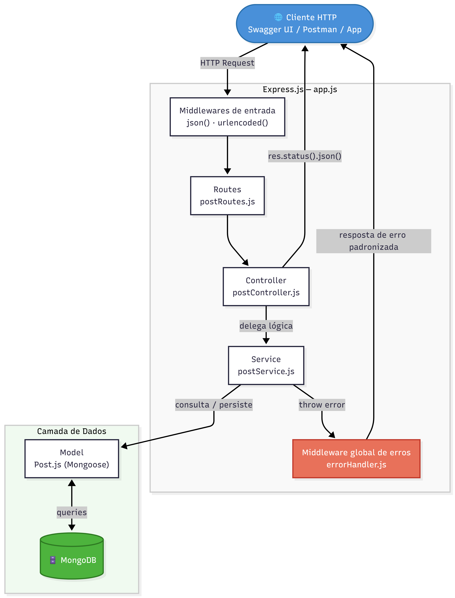
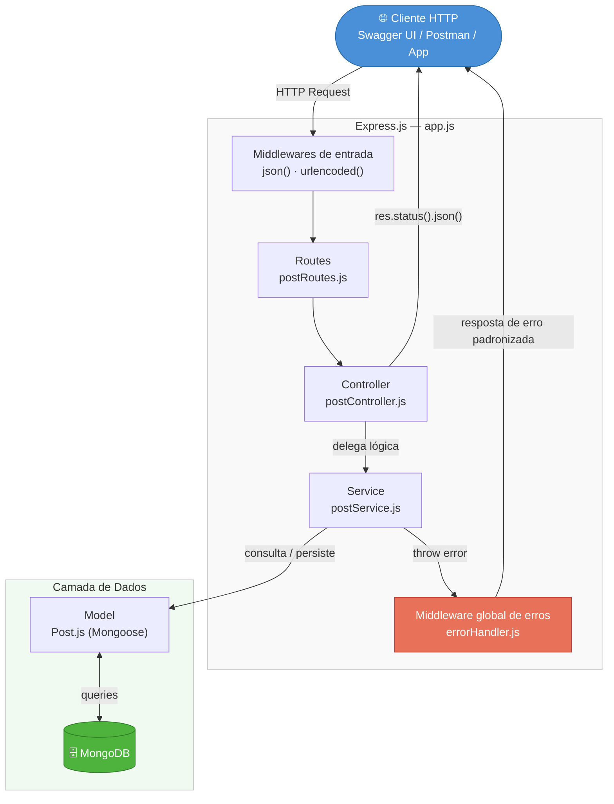
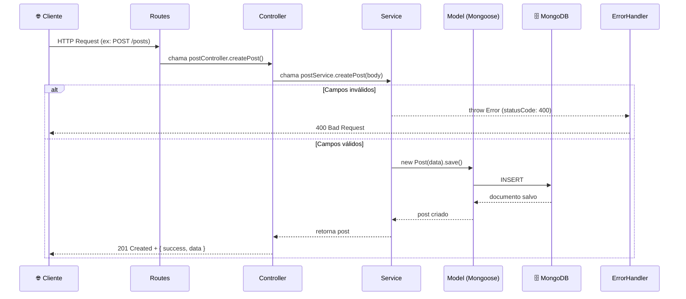
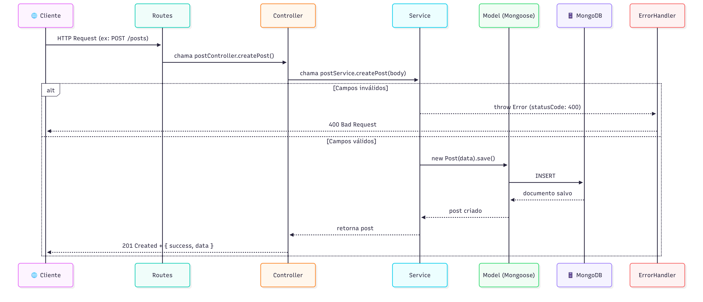
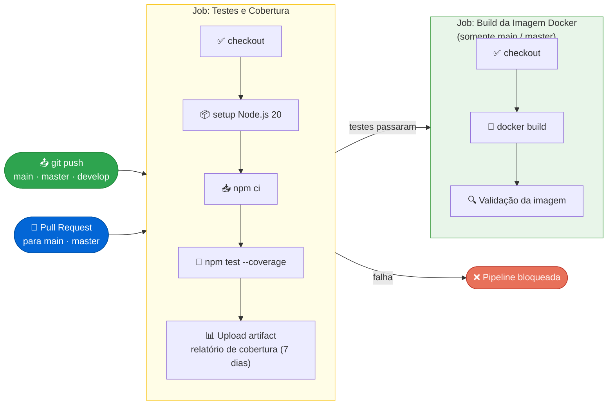

# Plataforma de Blogging Educacional


> API RESTful para gerenciamento de postagens voltada a professores e alunos da rede pública de educação.


---

## Sumário

1. [Visão Geral](#visão-geral)
2. [Arquitetura do Sistema](#arquitetura-do-sistema)
3. [Stack Tecnológica](#stack-tecnológica)
4. [Estrutura de Pastas](#estrutura-de-pastas)
5. [Pré-requisitos](#pré-requisitos)
6. [Como Executar](#como-executar)
7. [Endpoints da API](#endpoints-da-api)
8. [Testes](#testes)
9. [CI/CD](#cicd)
10. [Documentação Interativa (Swagger)](#documentação-interativa-swagger)
11. [Relato de Experiências e Desafios](#relato-de-experiências-e-desafios)

---

## Visão Geral

Este projeto consiste na refatoração e escalabilidade nacional de uma plataforma de blogging dinâmico. A aplicação foi originalmente validada em uma solução *low-code* (OutSystems) e migrada para uma arquitetura robusta e escalável com **Node.js** e **Express**.

O objetivo principal é oferecer um canal centralizado para que docentes publiquem aulas e conteúdos, e alunos os consumam de forma simples e acessível.

---

## Arquitetura do Sistema

A aplicação segue o padrão de **Arquitetura em Camadas (Layered Architecture)**, separando responsabilidades em módulos independentes e testáveis.

### Visão geral das camadas





### Fluxo de uma requisição HTTP




### Decisões de Arquitetura

| Decisão | Justificativa |
|---|---|
| **Camada de Service separada do Controller** | Isola a lógica de negócio, tornando-a independente do framework HTTP e 100% testável via mocks |
| **MongoDB com Mongoose** | Esquema flexível adequado para postagens com campos variáveis; Mongoose fornece validação no nível do modelo |
| **Middleware global de erros** | Centraliza o tratamento de exceções, evitando try/catch redundantes nos controllers |
| **Rota `/search` antes de `/:id`** | Previne que a string `"search"` seja interpretada como um MongoDB ObjectId, causando `CastError` |
| **Docker multi-stage build** | Reduz o tamanho da imagem final excluindo devDependencies; usuário não-root aumenta a segurança |

---

## Stack Tecnológica

| Camada | Tecnologia | Versão |
|---|---|---|
| Ambiente de execução | Node.js (LTS) | ≥ 18 |
| Framework Web | Express.js | 4.x |
| Banco de Dados | MongoDB + Mongoose | 7.x / 8.x |
| Containerização | Docker + Docker Compose | - |
| Testes | Jest + Supertest | 29.x / 7.x |
| Documentação | Swagger UI (swagger-jsdoc + swagger-ui-express) | - |
| CI/CD | GitHub Actions | - |

---

## Estrutura de Pastas

```
.
├── .github/
│   └── workflows/
│       └── ci.yml            # Pipeline: testes → build Docker
├── src/
│   ├── config/
│   │   ├── database.js       # Conexão com MongoDB via Mongoose
│   │   └── swagger.js        # Configuração OpenAPI 3.0
│   ├── controllers/
│   │   └── postController.js # Recebe req/res e delega ao service
│   ├── models/
│   │   └── Post.js           # Schema Mongoose com validações
│   ├── routes/
│   │   └── postRoutes.js     # Mapeamento de endpoints + JSDoc Swagger
│   ├── services/
│   │   └── postService.js    # Lógica de negócio e regras de validação
│   ├── middlewares/
│   │   └── errorHandler.js   # Tratamento global de erros HTTP
│   ├── app.js                # Configuração do Express
│   └── server.js             # Entrypoint: conecta DB e sobe o servidor
├── tests/
│   ├── unit/
│   │   └── postService.test.js     # 16 testes unitários (mocks do Model)
│   └── integration/
│       └── posts.test.js           # 15 testes de integração (mocks do Service)
├── .env.example              # Variáveis de ambiente necessárias
├── .gitignore
├── docker-compose.yml        # Orquestra app + MongoDB
├── Dockerfile                # Imagem de produção (multi-stage, não-root)
├── package.json
└── README.md
```

---

## Pré-requisitos

- **Node.js** ≥ 18 ([nodejs.org](https://nodejs.org))
- **Docker** e **Docker Compose** (para execução containerizada)
- **MongoDB** (local ou via Docker)

---

## Como Executar

### Opção 1 — Docker Compose (recomendado)

Sobe a API e o MongoDB juntos, sem precisar instalar nada além do Docker:

```bash
# Clonar o repositório
git clone https://github.com/seu-usuario/tech-challenge-fase-2.git
cd tech-challenge-fase-2

# Subir os containers
docker compose up --build
```

A API ficará disponível em `http://localhost:3000`.

### Opção 2 — Ambiente local

```bash
# 1. Instalar dependências
npm install

# 2. Configurar variáveis de ambiente
cp .env.example .env
# Edite o .env com sua URI do MongoDB

# 3. Iniciar em modo desenvolvimento (hot reload)
npm run dev
```

---

## Endpoints da API

Base URL: `http://localhost:3000`

| Método | Endpoint | Perfil | Descrição |
|:---|:---|:---|:---|
| `GET` | `/posts` | Geral | Lista todos os posts (mais recentes primeiro) |
| `GET` | `/posts/search?q=termo` | Geral | Busca por palavra-chave no título ou conteúdo |
| `GET` | `/posts/:id` | Geral | Retorna um post pelo ID |
| `POST` | `/posts` | Docente | Cria uma nova postagem |
| `PUT` | `/posts/:id` | Docente | Atualiza uma postagem existente |
| `DELETE` | `/posts/:id` | Docente | Remove uma postagem |
| `GET` | `/health` | - | Health check da aplicação |

### Corpo da requisição — POST / PUT

```json
{
  "titulo": "Introdução ao Node.js",
  "conteudo": "Node.js é um ambiente de execução JavaScript...",
  "autor": "Prof. Ana Souza"
}
```

### Códigos de status HTTP utilizados

| Código | Situação |
|---|---|
| `200 OK` | Leitura, atualização ou remoção bem-sucedida |
| `201 Created` | Post criado com sucesso |
| `400 Bad Request` | Campos obrigatórios ausentes ou ID inválido |
| `404 Not Found` | Post ou rota não encontrados |
| `500 Internal Server Error` | Erro inesperado no servidor |

---

## Testes

```bash
# Todos os testes com relatório de cobertura
npm test

# Apenas testes unitários
npm run test:unit

# Apenas testes de integração
npm run test:integration
```

### Resultado atual

| Suite | Testes | Resultado |
|---|---|---|
| `postService.test.js` (unitários) | 16 | ✅ PASS |
| `posts.test.js` (integração) | 15 | ✅ PASS |
| **Total** | **31** | **✅ PASS** |

### Cobertura de código

| Métrica | Resultado | Mínimo exigido |
|---|---|---|
| Statements | 92% | 20% |
| Functions | 88% | 20% |
| Branches | 73% | 20% |
| Lines | 92% | 20% |

Os testes unitários utilizam **mocks do Mongoose** (sem banco de dados real), garantindo execução rápida e determinística. Os testes de integração utilizam **mocks do Service**, cobrindo o comportamento completo das rotas HTTP.

---

## CI/CD

O pipeline é definido em [`.github/workflows/ci.yml`](.github/workflows/ci.yml) e é acionado automaticamente em:

- `push` nas branches `main`, `master` ou `develop`
- `pull_request` para `main` ou `master`

### Fluxo do pipeline





O relatório de cobertura fica disponível como **artifact** na aba Actions do GitHub por 7 dias.

---

## Documentação Interativa (Swagger)

Com a aplicação rodando, acesse:

```
http://localhost:3000/api-docs
```

A interface Swagger UI permite visualizar todos os endpoints, seus parâmetros e schemas, e executar chamadas diretamente pelo navegador.

---

## Relato de Experiências e Desafios

### Contexto

O projeto partiu de uma solução validada em OutSystems (plataforma *low-code*) e precisou ser completamente reescrito em Node.js, mantendo a mesma proposta de valor: um canal simples e centralizado para professores publicarem conteúdo e alunos consumirem.

### Desafios Técnicos

**1. Migração de low-code para código nativo**

A transição do OutSystems para Node.js exigiu que a equipe tomasse decisões de arquitetura que antes eram abstraídas pela plataforma — roteamento, validação, tratamento de erros, modelagem do banco e containerização. O principal aprendizado foi perceber que cada camada da aplicação tem uma responsabilidade clara, e que separá-las desde o início economiza retrabalho.

**2. Ordem de rotas no Express**

Um problema sutil encontrado foi que a rota `GET /posts/search` precisava ser declarada **antes** de `GET /posts/:id`. Sem essa ordem, o Express interpretava a string `"search"` como um MongoDB ObjectId, lançando um `CastError` indesejado. A solução foi simples, mas reforçou a importância de entender como o Express resolve rotas sequencialmente.

**3. Estratégia de testes sem banco de dados**

Testar funções que dependem do Mongoose sem um banco de dados real foi um desafio inicial. A solução adotada foi usar `jest.mock()` para substituir o Model do Mongoose por funções simuladas (*mocks*), tornando os testes unitários rápidos, isolados e independentes de infraestrutura. Nos testes de integração, o Service foi mockado para validar o comportamento das rotas HTTP de forma isolada.

**4. Tratamento centralizado de erros**

A equipe optou por um middleware global de erros no Express em vez de tratar exceções individualmente em cada controller. Isso exigiu a padronização de um campo `statusCode` nos objetos de erro lançados pelo Service, além do mapeamento dos erros nativos do Mongoose (`CastError`, `ValidationError`) para respostas HTTP adequadas. O resultado foi uma base de código muito mais limpa e consistente.

**5. Configuração do Docker multi-stage**

Garantir que a imagem Docker de produção não incluísse as `devDependencies` (Jest, Nodemon, Supertest) exigiu a adoção de um *multi-stage build*. O primeiro estágio instala apenas as dependências de produção com `npm ci --only=production`; o segundo estágio copia apenas o resultado. Isso reduziu significativamente o tamanho final da imagem e melhorou a postura de segurança ao rodar o processo com um usuário não-root.

**6. Pipeline CI/CD e branch naming**

Durante a configuração do GitHub Actions, o workflow foi inicialmente escrito para a branch `main`, mas o repositório usa `master` como branch padrão. Isso fez com que o pipeline não disparasse nos primeiros pushes. O problema foi identificado e corrigido adicionando `master` nas listas de trigger do workflow.

### Decisões que facilitaram o desenvolvimento

- **Async/await** em toda a camada assíncrona eliminou o *callback hell* e tornou o fluxo de erros previsível com `try/catch`.
- **Swagger via JSDoc** permitiu manter a documentação da API co-localizada com o código das rotas, reduzindo o risco de documentação desatualizada.
- **`.env.example`** versionado no repositório tornou o onboarding de novos membros da equipe mais ágil, deixando claro quais variáveis de ambiente são necessárias sem expor valores sensíveis.
